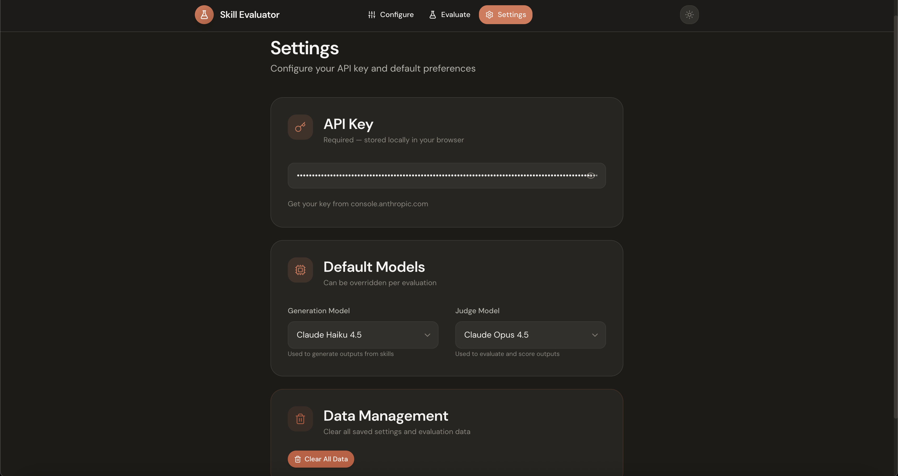

# 🧪 Skill Evaluator

A visual workbench for A/B testing AI skills. Upload two skill files, run them through a batch of test prompts, and let an AI judge score the results.

I built this to improve Anthropic's frontend design skill and prove the improvements with data. That project was hardcoded to frontend evaluation, so I extracted the core evaluation engine and made it extensible—now you can 1v1 any two skills, in any domain, with any model.

For the full story on how this started and why data-driven skill development matters, see [Teaching Claude to Design Better](https://www.justinwetch.com/blog/improvingclaudefrontend).

This project is a spiritual successor to my work on [Bloom GUI](https://github.com/justinwetch/bloom), a visual interface for Anthropic's behavioral evaluation framework. Building that taught me a lot about what makes evaluations useful—clear metrics, comparative analysis, and good visualization. I brought that learning (and the design language I developed there) into Skill Evaluator.

GUI by [Justin Wetch](https://github.com/justinwetch)

---

## Using the GUI

**Configure** — Upload two skill files (A and B) and set up your evaluation. Click the ✨ Generate button to have AI analyze your skills and create appropriate evaluation criteria and test prompts automatically. Choose your output type (text, visual, or both) based on what your skills produce.


**Evaluate** — Select your model and run all prompts through both skills simultaneously. Each prompt generates two outputs (one from Skill A, one from Skill B) which you can compare side-by-side. The status badges show progress in real-time.


**Results** — After generation, run the judge to score both outputs against your criteria. The summary view shows overall wins/losses, while the detailed breakdown reveals per-criterion scores and patterns.


**Settings** — Configure your Anthropic API key and set default models for generation and judging. Models can be overridden per-evaluation.



---

## Installation

### Prerequisites

- Node.js 18+
- Anthropic API key ([get one here](https://console.anthropic.com/))

### Clone and Setup

```bash
git clone https://github.com/justinwetch/SkillEval.git
cd SkillEval/app
npm install
```

### Running the GUI

```bash
npm run dev
```

Open **http://localhost:5173** in your browser.

### Running an Evaluation

1. Go to **Settings** and add your Anthropic API key
2. Go to **Configure** and upload two skill files
3. Click **Generate All from Skills** to auto-generate criteria and prompts
4. Go to **Evaluate** and click **Run All Evals**
5. Once generation completes, click **Judge All** to score the outputs
6. Review the results in Summary and Detailed Breakdown tabs

---

## Model Selection

Choose which model to evaluate your skills with. Different models may respond differently to the same skill instructions, so pick the one most relevant to your use case.

| Model | Characteristics |
|-------|-----------------|
| **Haiku 4.5** | Fast, cost-effective, good for iteration |
| **Sonnet 4.5** | Balanced capability and speed |
| **Opus 4.5** | Most capable, highest quality outputs |

For judging, **Opus 4.5** is recommended since it's the most capable model and provides the most nuanced scoring. That said, you can use Sonnet or Haiku for faster/cheaper judging, or to test how different judges evaluate the same outputs.

---

## Writing Skills

For documentation on how to write effective skill files, see [Claude Code Skills](https://code.claude.com/docs/en/skills).

The `test-skills/` folder contains example skill files you can use as reference:
- `sql-skill-a.md` — Basic SQL query generation skill
- `sql-skill-b.md` — Advanced SQL skill with optimization focus

---

## Screenshot Server (Optional)

For visual evaluations (HTML/CSS skills that produce rendered output), you'll need the screenshot server:

```bash
# From the project root
node screenshot-server.js
```

The server runs on port 3001 and uses Puppeteer to capture screenshots of rendered HTML. If you're evaluating text-only skills (code, SQL, writing, etc.), you don't need this.

---

## Project Structure

```
SkillEval/
├── app/                      # React application
│   ├── src/
│   │   ├── components/       # UI components
│   │   ├── contexts/         # React context (config, run state, settings)
│   │   ├── utils/            # Core logic (API, eval, judging)
│   │   └── views/            # Page components
│   └── package.json
├── test-skills/              # Example skill files
├── screenshots/              # GUI screenshots
├── screenshot-server.js      # Optional visual evaluation server
├── ARCHITECTURE.md           # Detailed architecture docs
└── DESIGN_SYSTEM.md          # UI design system specs
```

---

## Contributing

Contributions welcome! Open an issue for bugs, feature requests, or to share interesting skill files you've tested.

---

## License

MIT

---

## Credits

Thanks to Anthropic for the Skills framework and Claude models.

Built by [Justin Wetch](https://www.justinwetch.com)
