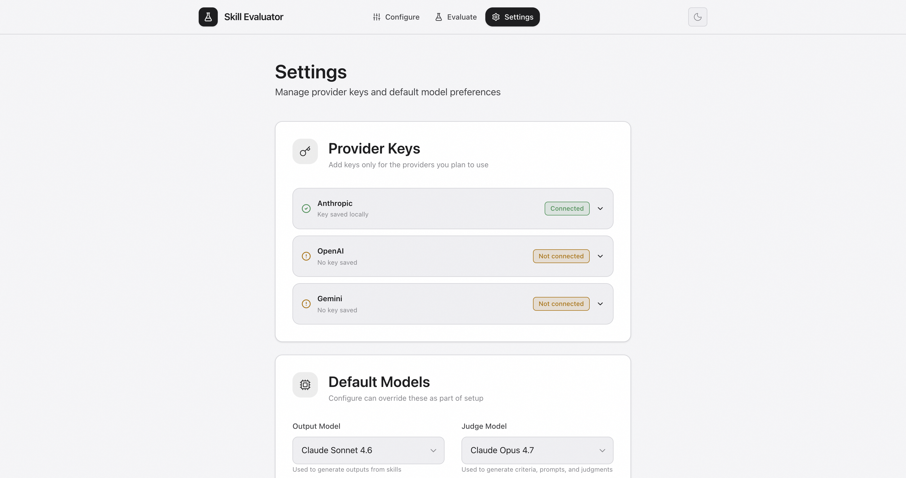
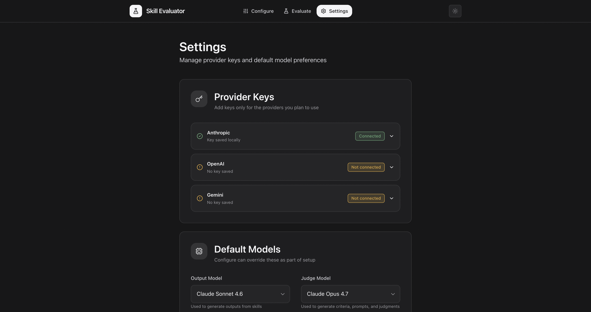

# 🧪 Skill Evaluator

A visual workbench for A/B testing AI skills. Upload two Agent Skill packages or single-file skills, run them through a batch of test prompts, and let an AI judge score the results.

DEMO VIDEO: [SkillEval v1.1 product video](https://www.linkedin.com/posts/justinwetch_skilleval-v11-is-out-now-featuring-a-refreshed-ugcPost-7463683888738058240-N887/)

I built this to improve Anthropic's frontend design skill and prove the improvements with data. That project was hardcoded to frontend evaluation, so I extracted the core evaluation engine and made it extensible—now you can 1v1 any two skills, in any domain, with any model.

For the full story on how this started and why data-driven skill development matters, see [Teaching Claude to Design Better](https://www.justinwetch.com/blog/improvingclaudefrontend).

---

## Current model catalog (September 2026)

The model selectors now include Claude Fable 5.1, Opus 5.5, and Sonnet 5; GPT-6 Astra, Sol, and Luna; Gemini 3.8 Flash; and Grok 4.7. GPT-5.6 and other earlier listed models remain selectable for existing evaluations. New installations default to Claude Sonnet 5 for output and Claude Opus 5.5 for judging. Previously saved supported model choices are preserved.

## v1.2 Update

### v1.2.1

Skill Evaluator v1.2.1 refreshed the supported frontier model list with Claude Opus 4.8, newer Gemini options, and Grok 4.3 through xAI. At that release, it removed disabled Anthropic Fable access, migrated older saved Opus defaults to Opus 4.8, and validated saved defaults so unsupported model IDs fell back safely.

Skill Evaluator v1.2 adds support for zipped Agent Skill packages. You can now upload a standard `.zip` skill package with a root `SKILL.md`, and Skill Evaluator will preserve its separate references, scripts, assets, and supporting files when generating configs and running evaluations.

Single-file `.md` and `.txt` skills still work as before, but internally they are treated as one-file Agent Skill packages so both upload paths use the same evaluation model.

---

## v1.1 Update

Skill Evaluator v1.1 adds support for current Anthropic, OpenAI, Google, and xAI models, expanding the app beyond Anthropic-only workflows. Model selection now supports provider-specific API keys, cross-provider choices, and separate defaults for skill output generation and judge scoring.

This release also introduces a refreshed design language, with cleaner surfaces, tighter controls, restrained depth, and fully considered light and dark modes.

---

## Using the GUI

**Configure** — Upload two single-file skills or zipped Agent Skill packages (A and B) and set up your evaluation. Click the ✨ Generate button to have AI analyze your skills and create appropriate evaluation criteria and test prompts automatically. Choose your output type (text, visual, or both) based on what your skills produce.

Light:


Dark:


Light:


Dark:


**Evaluate** — Select your model and run all prompts through both skills simultaneously. Each prompt generates two outputs (one from Skill A, one from Skill B) which you can compare side-by-side. The status badges show progress in real-time.

Light:


Dark:


**Results** — After generation, run the judge to score both outputs against your criteria. The summary view shows overall wins/losses, while the detailed breakdown reveals per-criterion scores and patterns.

Light:


Dark:


Light:


Dark:


**Settings** — Manage provider keys for Anthropic, OpenAI, Gemini, and xAI, then set default models for configuration, generation, and judging.

Light:


Dark:


---

## Installation

### Prerequisites

- Node.js 18+
- Provider key for at least one supported provider:
  - Anthropic ([console.anthropic.com](https://console.anthropic.com/))
  - OpenAI ([platform.openai.com](https://platform.openai.com/api-keys))
  - Gemini ([aistudio.google.com](https://aistudio.google.com/app/apikey))
  - xAI ([console.x.ai](https://console.x.ai/))

### Clone and Setup

```bash
git clone https://github.com/justinwetch/SkillEval.git
cd SkillEval
npm install
npm --prefix app install
```

### Running the GUI

```bash
npm run dev:app
```

Open **http://localhost:5173** in your browser.

### Running an Evaluation

1. Go to **Configure** and choose the Output model and Judge model
2. If a selected model needs provider access, click its **Add Key** action to open the right Settings panel
3. Upload two single-file skills or zipped Agent Skill packages
4. Click **Generate All from Skills** to auto-generate criteria and prompts
5. Go to **Evaluate** and click **Run All Evals**
6. Once generation completes, click **Judge All** to score the outputs
7. Review the results in Summary and Detailed Breakdown tabs

---

## Model Selection

Choose models deliberately for the two major phases. The Output model runs both skills, while the Judge model generates criteria/prompts and scores the results.

| Model | Provider | Characteristics |
|-------|----------|-----------------|
| **Claude Fable 5.1** | Anthropic | Highest capability option for demanding evaluations |
| **Claude Opus 5.5** | Anthropic | Strong model for criteria, prompts, and judging (default judge) |
| **Claude Sonnet 5** | Anthropic | Balanced capability and speed (default output generation) |
| **Claude Haiku 4.5** | Anthropic | Fast, cost-effective, good for iteration |
| **GPT-6 Astra / Sol / Luna** | OpenAI | Highest capability, balanced, and cost-sensitive options |
| **Gemini 3.8 Flash** | Gemini | Stable model for coding and agentic tasks |
| **Gemini 3.1 Pro Preview** | Gemini | Advanced Gemini Pro option |
| **Gemini 3.1 Flash-Lite** | Gemini | Lightweight option |
| **Grok 4.7** | xAI | Frontier text and image-input model via the Responses API |

For judging, **Claude Opus 5.5** is the default because strong reasoning is useful for criteria, prompts, and nuanced scoring. Claude Sonnet 5 is the default for skill output generation. Anthropic, OpenAI, Gemini, and xAI models are available in the same selectors when their provider keys are configured. Model availability can vary by account; an API key and provider access are required. Preview models may change or be retired.

Model IDs and availability were checked against the [Claude model catalog](https://platform.claude.com/docs/en/models/overview), [OpenAI model catalog](https://developers.openai.com/api/docs/models), [Gemini model catalog](https://ai.google.dev/gemini-api/docs/models), and [xAI Grok 4.7 documentation](https://docs.x.ai/developers/models/grok-4.7).

---

## Writing Skills

For documentation on how to write effective skill files, see [Claude Code Skills](https://code.claude.com/docs/en/skills).

Skill Evaluator accepts:
- `.zip` Agent Skill packages with a root `SKILL.md`
- `.md` single-file skills
- `.txt` single-file skills

The `test-skills/` folder contains example skill files you can use as reference:
- `sql-skill-a.md` — Basic SQL query generation skill
- `sql-skill-b.md` — Advanced SQL skill with optimization focus
- `zip-fixtures/` — Example zipped Agent Skill packages

---

## Local Runner (Optional)

For visual evaluations (HTML/CSS skills that produce rendered output), you'll need the local runner:

```bash
# From the project root
npm run server
```

The server runs on port 3001 and uses local Chrome through Puppeteer to capture screenshots of rendered HTML. If you're evaluating text-only skills (code, SQL, writing, etc.), you don't need this.

---

## Project Structure

```
SkillEval/
├── app/                      # React application
│   ├── src/
│   │   ├── components/       # UI components
│   │   ├── contexts/         # React context (config, run state, settings)
│   │   ├── utils/            # Core logic (API, eval, judging)
│   │   └── views/            # Page components
│   └── package.json
├── test-skills/              # Example skill files
├── screenshots/              # GUI screenshots
└── screenshot-server.js      # Optional local runner for visual evaluation
```

---

## Contributing

Contributions welcome! Open an issue for bugs, feature requests, or to share interesting skill files you've tested.

---

## License

MIT

---

## Credits

Built by [Justin Wetch](https://www.justinwetch.com)
